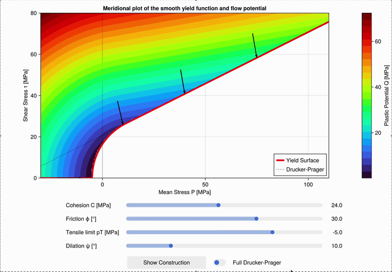

# PlasticViz.jl

In plasticity modelling, a meridional (P-τ) plot is used to inspect how yield strength and flow direction evolve with confining pressure. This project provides an interactive visualization of a smooth linearized Drucker-Prager shear failure envelope with a circular tensile cap function using the formulation from Popov et al. 2025. It is intended for educational purposes and is not a comprehensive plasticity modeling tool.

## Features



- Interactive sliders for cohesion, friction angle, tensile limit, and dilation angle.
- Optional Full Drucker-Prager mode.
- Yield surface, reference DP line, and plastic potential field visualization.
- Construction geometry and return-direction arrows.

## Installation

In Julia:

```julia
using Pkg
Pkg.add(url="https://github.com/Iddingsite/PlasticViz.jl")
```

## Usage

```julia
using PlasticViz

run_yield_plasticity()
```

## Parameters

| Parameter | Symbol | Unit | Description |
|-----------|--------|------|-------------|
| Cohesion | C | MPa | Shear strength of the material at zero confining pressure. It sets the intercept of the Drucker-Prager envelope on the τ axis. Higher cohesion shifts the yield surface upward, allowing the material to sustain more shear stress before yielding. |
| Friction angle | ϕ | ° | Controls the slope of the linear Drucker-Prager shear envelope. A higher friction angle means yield strength increases more steeply with confining pressure, typical of granular or frictional geomaterials. The dilation angle cannot exceed this value. |
| Tensile limit | pT | MPa | Sets the location of the tensile cut-off: the maximum tensile mean stress the material can sustain before the circular cap closes the yield surface. When Full Drucker-Prager is active, this is computed automatically as the apex of the cone (`-C cos ϕ / sin ϕ`) and the slider is locked. |
| Dilation angle | ψ | ° | Controls the direction of plastic flow (the flow potential). When ψ = ϕ the flow is associative (plastic strain normal to yield surface). When ψ < ϕ the flow is non-associative, producing less volumetric expansion during shearing, which is more realistic for most geomaterials. |

## Reference

Popov, A. A., Berlie, N., & Kaus, B. J. (2025). A dilatant visco-elasto-viscoplasticity model with globally continuous tensile cap: stable two-field mixed formulation. Geoscientific Model Development, 18(19), 7035-7058.