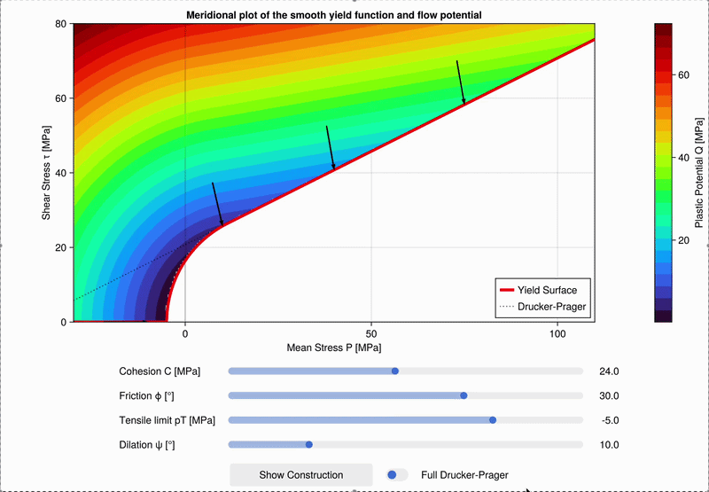

# PlasticViz.jl

**PlasticViz.jl** is an interactive Julia package for teaching and exploring plasticity concepts in geomechanics. It provides two interactive GUIs: a Mohr-Coulomb failure criterion visualiser aimed at students, and a meridional yield surface explorer for research use.

The package is intended for teaching and research in geomechanics and computational plasticity. It is not a standalone constitutive solver.

## Installation

In Julia:

```julia
using Pkg
Pkg.add(url="https://github.com/Iddingsite/PlasticViz.jl")
```

---

## Mohr-Coulomb Teaching GUI

An interactive GUI for teaching the Mohr-Coulomb failure criterion, designed for students.



It displays the Mohr circle in normal stress–shear stress space alongside a block sketch showing the orientation of the failure plane. The circle changes colour as the stress state approaches and crosses the Coulomb failure envelope:

- **Green** — stress state is safe (inside the failure envelope)
- **Orange** — critical (circle is tangent to the envelope)
- **Red** — failed (circle crosses the envelope)

The failure plane angle θ = 45° + φ/2 and the maximum shear stress τ_max = (σ₁ − σ₃)/2 are annotated live.

```julia
using PlasticViz

run_mohr_coulomb()

# Custom starting values
run_mohr_coulomb(c_default = 20.0, phi_default = 25.0,
                 sigma1_default = 60.0, sigma3_default = 5.0)
```

### Parameters

| Parameter | Symbol | Unit | Description |
|-----------|--------|------|-------------|
| Cohesion | c | MPa | Shear strength at zero confining pressure. Sets the τ-axis intercept of the Coulomb failure envelope. |
| Friction angle | φ | ° | Controls the slope of the failure envelope. Higher values mean strength increases more steeply with confining pressure. |
| Major principal stress | σ₁ | MPa | Largest principal stress applied to the sample. Sets the rightmost point of the Mohr circle. |
| Minor principal stress | σ₃ | MPa | Smallest principal stress. Sets the leftmost point of the Mohr circle. Cannot exceed σ₁. |

---

## Meridional Yield Surface GUI

An interactive visualiser for the P–τ meridional stress space, implementing the smooth linearised Drucker-Prager shear envelope with a circular tensile cap following Popov et al. (2025).

In plasticity modelling, the P–τ meridional plane shows how a material transitions from sub-yield behaviour (elastic or viscous) to plastic flow as confining pressure and deviatoric stress change:

- The **yield surface** separates the sub-yield domain (inside) from the plastic domain (outside).
- The **plastic potential field** (background colour) encodes the scalar distance to the yield surface.
- The **return-direction arrows** illustrate where a stress state outside the yield surface would be mapped back during a closest-point return-mapping algorithm.

```julia
using PlasticViz

run_yield_plasticity()

# Choose a different startup colormap
run_yield_plasticity(colormap = :viridis)
```

### Features

- Interactive sliders for cohesion (C), friction angle (ϕ), tensile limit (pT), and dilation angle (ψ).
- Optional Full Drucker-Prager mode (tensile limit locked to cone apex).
- Dropdown menu to switch colormaps interactively, with an invert toggle.
- Construction geometry overlay and return-direction arrows (togglable).
- **CSV import**: drag-and-drop or load a `.csv` file of stress points (P [MPa]; Shear [MPa]) to overlay them on the diagram. Points are automatically classified as:
  - *Elastic / Viscous* — inside the yield surface
  - *Mode 1* — plastic on the tensile cap
  - *Mode 2* — plastic on the Drucker-Prager shear envelope

### Parameters

| Parameter | Symbol | Unit | Description |
|-----------|--------|------|-------------|
| Cohesion | C | MPa | Shear strength of the material at zero confining pressure. It sets the intercept of the Drucker-Prager envelope on the τ axis. Higher cohesion shifts the yield surface upward, allowing the material to sustain more shear stress before yielding. |
| Friction angle | ϕ | ° | Controls the slope of the linear Drucker-Prager shear envelope. A higher friction angle means yield strength increases more steeply with confining pressure, typical of granular or frictional geomaterials. The dilation angle cannot exceed this value. |
| Tensile limit | pT | MPa | Sets the location of the tensile cut-off: the maximum tensile mean stress the material can sustain before the circular cap closes the yield surface. When Full Drucker-Prager is active, this is computed automatically as the apex of the cone (`-C cos ϕ / sin ϕ`) and the slider is locked. |
| Dilation angle | ψ | ° | Controls the direction of plastic flow (the flow potential). When ψ = ϕ the flow is associative (plastic strain normal to yield surface). When ψ < ϕ the flow is non-associative, producing less volumetric expansion during shearing, which is more realistic for most geomaterials. |

---

## Reference

Popov, A. A., Berlie, N., & Kaus, B. J. (2025). A dilatant visco-elasto-viscoplasticity model with globally continuous tensile cap: stable two-field mixed formulation. Geoscientific Model Development, 18(19), 7035-7058.
